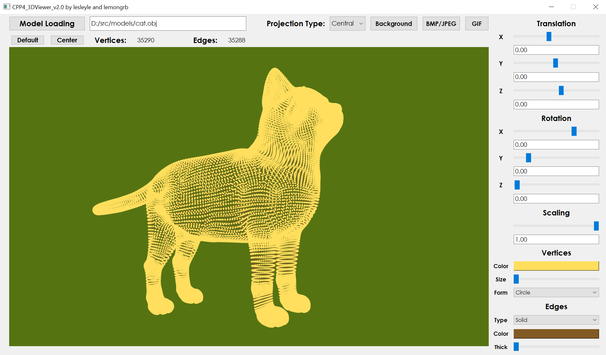
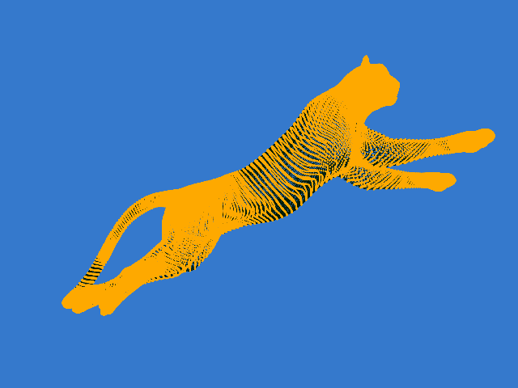

# 3DViewer

## Содержание
1. [О проекте](#о-проекте)
2. [Особенности проекта](#особенности-проекта)
3. [Сборка](#сборка)
4. [Участники проекта](#участники-проекта)

## О проекте

В данном учебном проекте "Школы 21" была реализована программа для просмотра 3D-объектов, загруженных из obj-файлов. В программе использовались:
* язык C++17 - логическая часть (загрузка, обработка файла, преобразования модели);
* Qt 6 - визуализация пользовательского интерфейса.

*Отображение модели cat.obj*

*Демонстрация работы программы 3DViewer*

### Список возможностей программы:

* Программа загружает только одну модель за один раз (поддерживаются только списки вершин и поверхностей);
* Модель можно перемещать, вращать по осям X, Y, Z с помощью ползунка или ввода значений в поле ниже вручную. Есть валидация на введенные значения (используются регулярные выражения);
* Модель масштабируется в соответсвии с введенным значением в поле/ползунком;
* Есть кнопка загрузки модели, где выбирается путь к необходимому obj-файлу. Либо же пользователь может самостоятельно ввести абсолютный путь в поле левее. Присутствует защита от нежелаемого/невалидного ввода;
* После загрузки модели пользователю предоставляется информация о количестве вершин и ребер;
* Возможность вернуть модель в первоначальный вид с помощью кнопки **Default** или отцентрировать модель при наличии перемещений при нажатии на **Center**;
* Пользователь имеет возможность выбрать тип отображаемой проекции - центральный или параллельный;
* Имеются кнопки выбора цвета фона, вершин, ребер модели;
* Имеются ползунки изменения размера вершин, толщины ребер;
* Имеются поля со списком, где можно менять форму отображаемых вершин(круг, квадрат, ничего), тип отрисовки ребер(сплошная, пунктирная);
* Пользователь может сделать "скриншот" с моделью и сохранить его в формате BMP/JPEG с помощью кнопки в окне программы или горячих клавиш **Сtrl** + **S**;
* Программа сохраняет скринкасты - GIF-изображения длительностью 5 секунд с частотой кадров 10 fps с разрешением 640x480 при нажатии на соответствующую кнопку в окне программы или на комбинацию клавиш **Ctrl** + **G**;
* Выход из программы на горячую клавишу **Esc**;

	

	

	*Записанное GIF-изображение*
	

## Особенности проекта

В рамках учебного проекта неоходимо было соответствовать следующим требованиям:

* Программа разработана в соответствии с принципами объектно-ориентированного программирования;
* При написании кода необходимо придерживаться Google Style;
* Пользовательские классы реализованы с namespace "s21";
* Логическая часть программы была написана с использованием не менее трех паттернов проектирования. В нашем проекте были использованы: синглтон, фасад, шаблонный метод;
* Также был использован паттерн MVC для связывания логической и графической части программы с помощью тонкого контроллера;
* Программа визуализирует модели с вершинами более 500 тысяч без зависаний интерфейса более 0,5 секунд;
* Все пользовательские настройки (тип проекции, толщина линий, цвет, форма и т.п.), измененные в текущей сессии, сохраняются при выходе из программы;
* Обеспечение полного покрытия unit-тестами модулей, связанных с загрузкой моделей и аффинными преобразованиями.

## Сборка

Сборка программы производится с помощью Makefile, Qt автоматизирует сборку через CMake. Имеются следующие цели:

&nbsp;&nbsp;&nbsp;&nbsp;``all`` - включает в себя цели gcov_report и dist;

&nbsp;&nbsp;&nbsp;&nbsp;``install`` - собирает проект и перемещает его в папку build;

&nbsp;&nbsp;&nbsp;&nbsp;``launch`` - запускает проект 3DViewer;

&nbsp;&nbsp;&nbsp;&nbsp;``uninstall`` - удаляет папку build с проектом;

&nbsp;&nbsp;&nbsp;&nbsp;``clean`` - возвращает проект в первоначальный вид;

&nbsp;&nbsp;&nbsp;&nbsp;``install_doxygen`` - устанавливает Doxygen (инструмент для генерации документации из исходного кода);

&nbsp;&nbsp;&nbsp;&nbsp;``dvi`` - генерирует докуменатацию с помощью Doxygen;

&nbsp;&nbsp;&nbsp;&nbsp;``dist`` - создание архив-пакета, содержащего в себе все необходимые файлы и инструкции для установки программы;

&nbsp;&nbsp;&nbsp;&nbsp;``tests`` - запуск unit-тестов на проверку модулей, связанных с загрузкой моделей и аффинными преобразованиями, с помощью библиотеки GTest;

&nbsp;&nbsp;&nbsp;&nbsp;``gcov_report`` - генерация html-отчета с помощью lcov для измерения покрытия кода тестами;

&nbsp;&nbsp;&nbsp;&nbsp;``check`` - включает в себя цели cpp_check и valgrind, а также анализирует код на стилистические нормы; 

&nbsp;&nbsp;&nbsp;&nbsp;``cpp_check`` - проверка кода на ошибки, уязвимости, неправильное использование переменных, операторов;

&nbsp;&nbsp;&nbsp;&nbsp;``valgrind`` - проверка файла с тестами на возможные утечки.

## Участники проекта

| Участник      |            |
| ------------- | ------------------ |
| [lesleyle](https://github.com/IvanVito) | Логическая часть (загрузка моделей, афинные преобразования), контроллер, unit-тесты    |
| [lemongrb](https://github.com/Shyrasya) | Визуальная часть (работа в Qt - разработка интерфейса, отрисовка модели с использованием OpenGL) |
